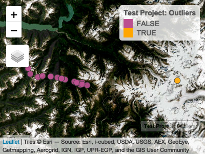
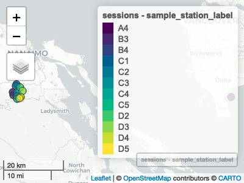
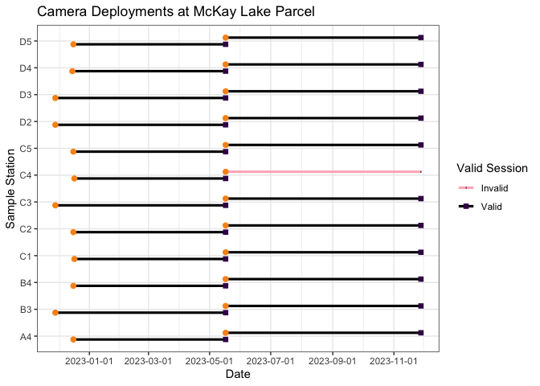
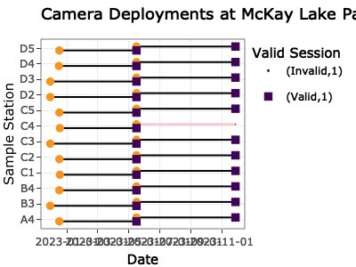
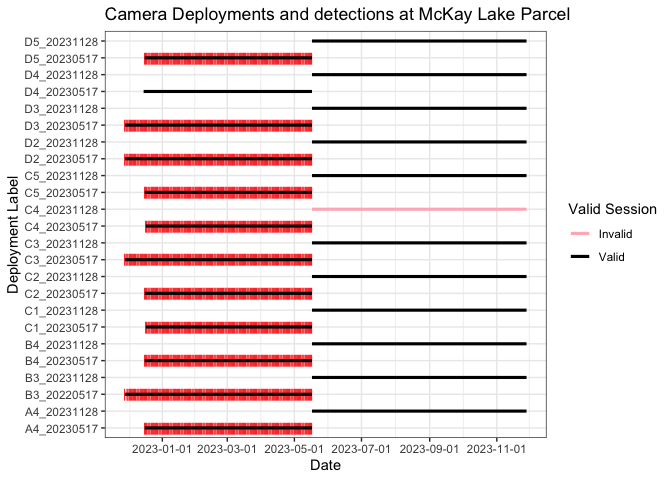
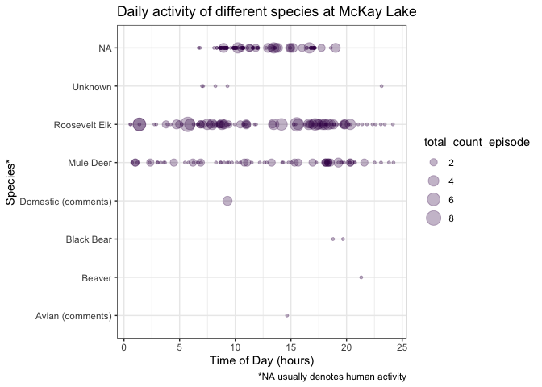
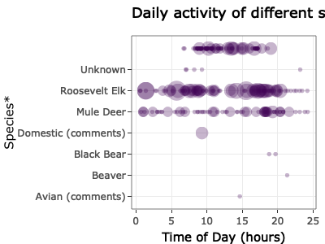

<!-- README.md is generated from README.Rmd. Please edit that file -->

# bccamtrap

<!-- badges: start -->

[](https://github.com/ateucher/bccamtrap/actions/workflows/R-CMD-check.yaml)
[](https://github.com/bcgov/repomountie/blob/master/doc/lifecycle-badges.md)
[](https://app.codecov.io/gh/bcgov/bccamtrap?branch=main)
<!-- badges: end -->

Functions for QA and validation of Camera Trap data

## Installation

You can install the development version of bccamtrap from
[GitHub](https://github.com/) using the
[devtools](https://devtools.r-lib.org/) package (you may need to install
it first):

``` r
# install.packages("devtools")
devtools::install_github("bcgov/bccamtrap")
```

## Example Usage

This package is being developed for camera trap studies in the West
Coast Region, BC Ministry of Water, Land, and Resource Stewardship
(WLRS).

The functions in this package currently assume your project and
session-level data are stored in a BC Government [Wildlife Data
Submission
Template](https://www2.gov.bc.ca/gov/content?id=DC67BCBF8B1E462889B854364364D2D1)
for Camera Trap Data, augmented with additional fields.

The image data is expected to be in multiple csv files, in one folder
per project. The csv files have been generated by reviewing the images
in [TimeLapse](https://saul.cpsc.ucalgary.ca/timelapse/) software, using
the template `v20230518`.

To begin, set the paths to the project metadata file, and the folder
containing the TimeLapse image files:

``` r
library(bccamtrap)

metadata_path <- "~/data/project-files/project_1_RISC_WCR_Database_Template_v20230518.xlsm"
data_path <- "~/data/wc-wlrs-cam-data/camera-data/project_1/"
```

### Project and station metadata

Read in project metadata from the SPI worksheet. There are functions to
read the relevant tabs:

### Project Information

``` r
proj <- read_project_info(metadata_path)
proj
#> # A tibble: 1 × 4
#>   spi_project_id project_name                  survey_name survey_intensity_code
#> * <chr>          <chr>                         <chr>       <chr>                
#> 1 <NA>           2022 - ongoing - Roosevelt E… 2022-2023 … <NA>
```

#### Sample station information

Read the sample station information. This creates a spatial data frame
of class `"sf"`, from the [sf](https://r-spatial.github.io/sf/) package.
This format allows us to work with it as a regular data frame, but also
do spatial things with it.

``` r
sample_stations <- read_sample_station_info(metadata_path)
sample_stations
#> Simple feature collection with 13 features and 28 fields
#> Geometry type: POINT
#> Dimension:     XY
#> Bounding box:  xmin: -124.0056 ymin: 49.02882 xmax: -123.0228 ymax: 49.07136
#> Geodetic CRS:  WGS 84
#> # A tibble: 13 × 29
#>    study_area_name study_area_photos sample_station_label utm_zone_sample_stat…¹
#>  * <chr>           <chr>             <chr>                                 <dbl>
#>  1 McKay Lake Par… Y                 A4                                       NA
#>  2 McKay Lake Par… Y                 B3                                       NA
#>  3 McKay Lake Par… Y                 B4                                       NA
#>  4 McKay Lake Par… Y                 C1                                       NA
#>  5 McKay Lake Par… Y                 C2                                       NA
#>  6 McKay Lake Par… Y                 C3                                       NA
#>  7 McKay Lake Par… Y                 C4                                       NA
#>  8 McKay Lake Par… Y                 C5                                       NA
#>  9 McKay Lake Par… Y                 D2                                       NA
#> 10 McKay Lake Par… Y                 D3                                       NA
#> 11 McKay Lake Par… Y                 D4                                       NA
#> 12 McKay Lake Par… Y                 D5                                       NA
#> 13 McKay Lake Par… Y                 C4                                       NA
#> # ℹ abbreviated name: ¹​utm_zone_sample_station
#> # ℹ 25 more variables: easting_sample_station <dbl>,
#> #   northing_sample_station <dbl>, latitude_sample_station_dd <dbl>,
#> #   longitude_sample_station_dd <dbl>, station_status <chr>,
#> #   number_of_cameras <dbl>, set_date <date>, general_location <chr>,
#> #   elevation_m <dbl>, slope_percent <dbl>, aspect_degrees <dbl>,
#> #   crown_closure_percent <dbl>, camera_bearing_degrees <dbl>, …
```

Use the `check_stations_spatial()` function to run some basic spatial
validation on the data - namely checking for spatial outliers:

``` r
sample_stations <- check_stations_spatial(sample_stations)
#> ! Station A4 appears to be very far away from other stations. Please check its
#> coordinates.
```

Use the `summary()` method for Sample Station Info for basic descritive
stats:

``` r
summary(sample_stations)
#> ┌ McKay Lake Parcel ──┐
#> │                     │
#> │   Sample Stations   │
#> │                     │
#> └─────────────────────┘
#> ℹ 12 sample stations in 13 locations.
#> ℹ Summary of station distances (m):
#>     Min.  1st Qu.   Median     Mean  3rd Qu.     Max. 
#>    50.26  1600.31  2694.84 12805.59  3896.18 71655.56
#> ✖ Detected 1 potential spatial outlier.
#> ℹ Station status summary:
#> Camera Active Camera Stolen 
#>            12             1
#> ℹ Set dates: Between 2022-11-28 and 2023-11-28
#> ! Run `map_stations(object)` to view stations on a map.
```

Use the `map_stations()` function to create an interactive map the of
the stations. This will show any potential outlying stations, indicating
possible data errors:

``` r
map_stations(sample_stations)
```



#### Camera Setup and Checks:

``` r
camera_setup_checks <- read_cam_setup_checks(metadata_path)
camera_setup_checks
#> # A tibble: 36 × 31
#>    study_area_name  sample_station_label deployment_label camera_label surveyors
#>  * <chr>            <chr>                <chr>            <chr>        <chr>    
#>  1 McKay Lake Parc… A4                   <NA>             Eco2553      MB, MS   
#>  2 McKay Lake Parc… B3                   <NA>             Eco1481      MB, MS   
#>  3 McKay Lake Parc… B4                   <NA>             Eco1489      MB, MS   
#>  4 McKay Lake Parc… C1                   <NA>             Eco9814      MB, MS   
#>  5 McKay Lake Parc… C2                   <NA>             Eco1312      MB, MS   
#>  6 McKay Lake Parc… C3                   <NA>             Eco1478      MB, MS   
#>  7 McKay Lake Parc… C4                   <NA>             Eco9815      MB, MS   
#>  8 McKay Lake Parc… C5                   <NA>             Eco8313      MB, MS   
#>  9 McKay Lake Parc… D2                   <NA>             Eco2319      MB, MS   
#> 10 McKay Lake Parc… D3                   <NA>             Eco9929      MB, MS   
#> # ℹ 26 more rows
#> # ℹ 26 more variables: date_time_checked <dttm>, sampling_start <dttm>,
#> #   sampling_end <dttm>, total_visit_or_deployment_time <dbl>,
#> #   unit_of_total_time_code <chr>, visit_type <chr>,
#> #   camera_status_on_arrival <chr>, battery_level <chr>,
#> #   batteries_changed <chr>, number_of_photos <dbl>, quiet_period_s <chr>,
#> #   trigger_sensitivity <chr>, trigger_timing_s <dbl>, …
```

#### Sample Sessions (deployments)

Rather than just looking at the raw camera setup and checks or stations,
there is more utility in assembling sampling sessions by combining the
sample station information and the camera setup and checks. Do this with
the `make_sample_sessions()` function.

``` r
sessions <- make_sample_sessions(metadata_path)
sessions
#> Simple feature collection with 24 features and 59 fields
#> Geometry type: POINT
#> Dimension:     XY
#> Bounding box:  xmin: -124.0056 ymin: 49.02882 xmax: -123.0228 ymax: 49.07136
#> Geodetic CRS:  WGS 84
#> # A tibble: 24 × 60
#>    study_area_name  sample_station_label deployment_label camera_label surveyors
#>  * <chr>            <chr>                <chr>            <chr>        <chr>    
#>  1 McKay Lake Parc… A4                   A4_20230517      Eco2553      CM, BT   
#>  2 McKay Lake Parc… B3                   B3_20220517      Eco1481      CM, BT   
#>  3 McKay Lake Parc… B4                   B4_20230517      Eco1489      CM, BT   
#>  4 McKay Lake Parc… C1                   C1_20230517      Eco9814      CM, BT   
#>  5 McKay Lake Parc… C2                   C2_20230517      Eco1312      CM, BT   
#>  6 McKay Lake Parc… C3                   C3_20230517      Eco1478      CM, BT   
#>  7 McKay Lake Parc… C4                   C4_20230517      Eco9815      CM, BT   
#>  8 McKay Lake Parc… C5                   C5_20230517      Eco8313      CM, BT   
#>  9 McKay Lake Parc… D2                   D2_20230517      Eco2319      CM, BT   
#> 10 McKay Lake Parc… D3                   D3_20230517      Eco9929      CM, BT   
#> # ℹ 14 more rows
#> # ℹ 55 more variables: date_time_checked <dttm>, sampling_start <dttm>,
#> #   sampling_end <dttm>, sample_duration_days <dbl>,
#> #   sample_duration_valid <lgl>, total_visit_or_deployment_time <dbl>,
#> #   unit_of_total_time_code <chr>, visit_type <chr>,
#> #   camera_status_on_arrival <chr>, battery_level <chr>,
#> #   batteries_changed <chr>, number_of_photos <dbl>, quiet_period_s <chr>, …
```

There is a handy `summary()` method for this as well:

``` r
summary(sessions)
#> ┌ McKay Lake Parcel ──┐
#> │                     │
#> │   Sample Sessions   │
#> │                     │
#> └─────────────────────┘
#> ℹ 12 sample stations in 24 deploymentss.
#> ℹ Sample sessions lengths range between 151 and 195 days.
#> ✖ There is 1 invalid sample session.
#> ℹ Camera status on arrival summary:
#> Active Stolen 
#>     23      1
#> ℹ There are 30041 images. Photos per session range betwen 216 and 14444.
```

We can use the [mapview](https://r-spatial.github.io/mapview/) package
to quickly visualize this, setting the `zcol` argument to the name of
the column you’d like to colour the points by. Clicking on a point will
give you the details of that sample session.

``` r
library(mapview)
mapview(sessions, zcol = "sample_station_label")
```



### Image data

We can read in an entire directory of image data from multiple csv
files, as long as they all follow the same TimeLapse template. Currently
it is expected that they follow the `v20230518` template.

``` r
image_data <- read_image_data(data_path)
image_data
#> # A tibble: 5,111 × 42
#>    root_folder study_area_name sample_station_label deployment_label
#>  * <chr>       <chr>           <chr>                <chr>           
#>  1 A4_20230517 McKay Lake      A4                   A4_20230517     
#>  2 A4_20230517 McKay Lake      A4                   A4_20230517     
#>  3 A4_20230517 McKay Lake      A4                   A4_20230517     
#>  4 A4_20230517 McKay Lake      A4                   A4_20230517     
#>  5 A4_20230517 McKay Lake      A4                   A4_20230517     
#>  6 A4_20230517 McKay Lake      A4                   A4_20230517     
#>  7 A4_20230517 McKay Lake      A4                   A4_20230517     
#>  8 A4_20230517 McKay Lake      A4                   A4_20230517     
#>  9 A4_20230517 McKay Lake      A4                   A4_20230517     
#> 10 A4_20230517 McKay Lake      A4                   A4_20230517     
#> # ℹ 5,101 more rows
#> # ℹ 38 more variables: date_time <dttm>, episode <chr>, species <chr>,
#> #   total_count_episode <dbl>, obj_count_image <int>, adult_male <int>,
#> #   adult_female <int>, adult_unclassified_sex <int>, yearling_male <int>,
#> #   yearling_female <int>, yearling_unclassified_sex <int>,
#> #   young_of_year_unclassified_sex <int>, juvenile_unclassified_sex <int>,
#> #   male_unclassified_age <int>, female_unclassified_age <int>, …
```

Again, we can use the `summary()` method to get an overview of the image
data.

``` r
summary(image_data)
#> ┌ McKay Lake ───────┐
#> │                   │
#> │   Image summary   │
#> │                   │
#> └───────────────────┘
#> ℹ 5111 images in 11 deployments at 11 sample stations.
#> ℹ 71 images with lens obscured.
#> ℹ 0 images starred.
#> ! 0 images flagged for review.
#> ℹ Dates are between 2022-11-28 and 2023-05-17.
#> ℹ Temperatures are between -14 and 27 C.
#> ℹ Snow depths are between 0 and 15 cm.
#> ℹ Species counts:
#>    Avian (comments)              Beaver          Black Bear Domestic (comments) 
#>                   1                   1                   2                   1 
#>           Mule Deer       Roosevelt Elk             Unknown                <NA> 
#>                  69                  96                   5                4936
#> ! Run `check_deployment_images()` to crosscheck images with deployments.
```

Use the `check_deployment_images()` function to find deployment labels
that are in the sample session data but not in the image data, and
vice-versa. It is usually likely that there will be deployment labels in
the sample session data that are missing from the image data if not all
of the images have been processed yet. Deployment labels that are
present in the image data but not in the sample session data indicate a
potential problem.

``` r
check_deployment_images(sessions, image_data)
#> ! The following deployment labels are present in `sessions` but not `image_data`: "D4_20230517", "A4_20231128", "B3_20231128", "B4_20231128", "C1_20231128", "C2_20231128", "C3_20231128", "C4_20231128", "C5_20231128", "D2_20231128", "D3_20231128", "D4_20231128", and "D5_20231128"
```

### Plots

#### Deployment plot

We can plot deployments to see that the start and ends of our
deployments are as expected, and flag any “invalid” sessions (i.e.,
where we don’t know the end time because a camera was stolen, bumped,
ran out of batteries etc.). You can make static or interactive plots:

``` r
plot_deployments(sessions, date_breaks = "2 months")
```



``` r
plot_deployments(sessions, interactive = TRUE, date_breaks = "2 months")
```



#### Detection plot

We can also plot image timestamps over the deployment durations to alert
us to potential time mismatches between the session data and image time
labels:

``` r
plot_deployment_detections(sessions, image_data, date_breaks = "2 months")
```



``` r
plot_deployment_detections(sessions, image_data, interactive = TRUE, date_breaks = "2 months")
```


#### Daily detection patterns

We can plot the patterns of daily detections by species:

``` r
plot_diel_activity(image_data)
```



``` r
plot_diel_activity(image_data, interactive = TRUE)
```



### Project Status

### Getting Help or Reporting an Issue

To report bugs/issues/feature requests, please file an
[issue](https://github.com/bcgov/bccamtrap/issues/).

### How to Contribute

If you would like to contribute, please see our
[CONTRIBUTING](CONTRIBUTING.md) guidelines.

Please note that this project is released with a [Contributor Code of
Conduct](CODE_OF_CONDUCT.md). By participating in this project you agree
to abide by its terms.

### License

    Copyright 2024 Province of British Columbia

    Licensed under the Apache License, Version 2.0 (the &quot;License&quot;);
    you may not use this file except in compliance with the License.
    You may obtain a copy of the License at

    http://www.apache.org/licenses/LICENSE-2.0

    Unless required by applicable law or agreed to in writing, software distributed under the License is distributed on an &quot;AS IS&quot; BASIS,
    WITHOUT WARRANTIES OR CONDITIONS OF ANY KIND, either express or implied.
    See the License for the specific language governing permissions and limitations under the License.
