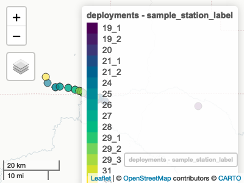
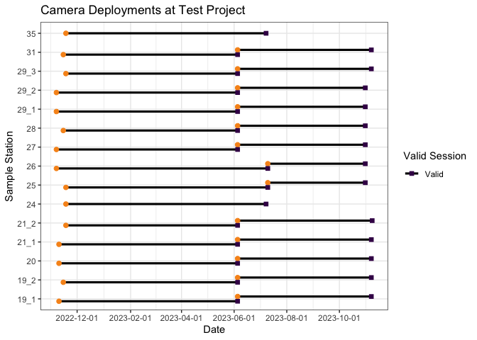
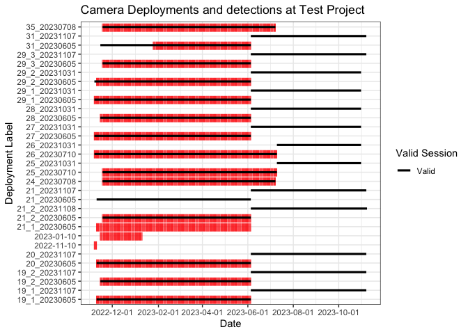
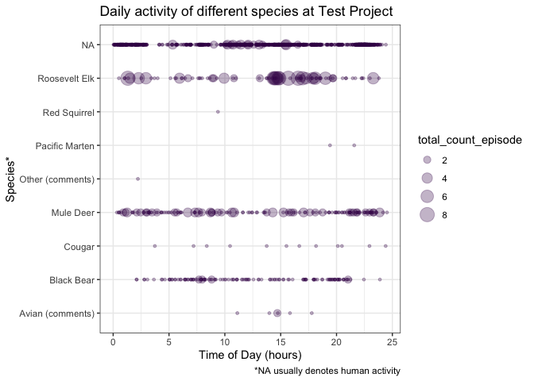

<!-- README.md is generated from README.Rmd. Please edit that file -->

# bccamtrap

<!-- badges: start -->

[](https://github.com/ateucher/bccamtrap/actions/workflows/R-CMD-check.yaml)
[](https://github.com/bcgov/repomountie/blob/master/doc/lifecycle-badges.md)
[](https://app.codecov.io/gh/bcgov/bccamtrap?branch=main)
<!-- badges: end -->

Functions for QA and validation of Camera Trap data

## Installation

You can install the development version of bccamtrap from
[GitHub](https://github.com/) using the
[devtools](https://devtools.r-lib.org/) package (you may need to install
it first):

``` r
# install.packages("devtools")
devtools::install_github("bcgov/bccamtrap")
```

## Example Usage

This package is being developed for camera trap studies in the West
Coast Region, BC Ministry of Water, Land, and Resource Stewardship
(WLRS).

The functions in this package currently assume your project and
session-level data are stored in a BC Government [Wildlife Data
Submission
Template](https://www2.gov.bc.ca/gov/content?id=DC67BCBF8B1E462889B854364364D2D1)
for Camera Trap Data, augmented with additional fields.

The image data is expected to be in multiple csv files, in one folder
per project. The csv files have been generated by reviewing the images
in [TimeLapse](https://saul.cpsc.ucalgary.ca/timelapse/) software, using
the template `v20230518`.

**Note that example data has been obfuscated to protect the location of
the projects.**

To begin, set the paths to the project metadata file, and the folder
containing the TimeLapse image files:

``` r
library(bccamtrap)

metadata_path <- "~/data/project-files/project_1_RISC_WCR_Database_Template_v20230518.xlsm"
data_path <- "~/data/wc-wlrs-cam-data/camera-data/project_1/"
```

### Project and station metadata

Read in project metadata from the SPI worksheet. There are functions to
read the relevant tabs:

### Project Information

``` r
proj <- read_project_info(metadata_path)
proj
#> # A tibble: 1 × 4
#>   spi_project_id project_name                  survey_name survey_intensity_code
#> * <chr>          <chr>                         <chr>       <chr>                
#> 1 <NA>           2022 - ongoing - Roosevelt E… 2022-2023 … <NA>
```

#### Sample station information

Read the sample station information. This creates a spatial data frame
of class `"sf"`, from the [sf](https://r-spatial.github.io/sf/) package.
This format allows us to work with it as a regular data frame, but also
do spatial things with it.

``` r
sample_stations <- read_sample_station_info(metadata_path)
sample_stations
```

    #> Simple feature collection with 21 features and 28 fields
    #> Geometry type: POINT
    #> Dimension:     XY
    #> Bounding box:  xmin: -126.8515 ymin: 51.47261 xmax: -126.0528 ymax: 51.52903
    #> Geodetic CRS:  WGS 84
    #> # A tibble: 21 × 23
    #>    study_area_name study_area_photos sample_station_label station_status
    #>    <chr>           <chr>             <chr>                <chr>         
    #>  1 Test Project    Y                 19_1                 Camera Active 
    #>  2 Test Project    Y                 19_2                 Camera Active 
    #>  3 Test Project    Y                 20                   Camera Active 
    #>  4 Test Project    Y                 21_1                 Camera Active 
    #>  5 Test Project    Y                 21_2                 Camera Active 
    #>  6 Test Project    Y                 24                   Camera Active 
    #>  7 Test Project    Y                 25                   Camera Active 
    #>  8 Test Project    Y                 26                   Camera Active 
    #>  9 Test Project    Y                 27                   Camera Moved  
    #> 10 Test Project    Y                 28                   Camera Active 
    #> # ℹ 11 more rows
    #> # ℹ 19 more variables: number_of_cameras <dbl>, set_date <date>,
    #> #   general_location <chr>, elevation_m <dbl>, slope_percent <dbl>,
    #> #   aspect_degrees <dbl>, crown_closure_percent <dbl>,
    #> #   camera_bearing_degrees <dbl>, camera_height_cm <dbl>,
    #> #   distance_to_feature_m <dbl>, visible_range_m <dbl>, habitat_feature <chr>,
    #> #   lock <chr>, code <chr>, sample_station_comments <chr>, …

Use the `check_stations_spatial()` function to run some basic spatial
validation on the data - namely checking for spatial outliers:

``` r
sample_stations <- check_stations_spatial(sample_stations)
#> ! Station 19_1 appears to be very far away from other stations. Please check
#> its coordinates.
```

Use the `summary()` method for Sample Station Info for basic descriptive
stats:

``` r
summary(sample_stations)
#> ┌ Test Project ───────┐
#> │                     │
#> │   Sample Stations   │
#> │                     │
#> └─────────────────────┘
#> ℹ 18 sample stations in 21 locations.
#> ℹ Summary of station distances (m):
#>     Min.  1st Qu.   Median     Mean  3rd Qu.     Max. 
#>     5.08  4243.90  8703.08 11924.92 14548.23 55460.22
#> ✖ Detected 1 potential spatial outlier.
#> ℹ Station status summary:
#> Camera Active  Camera Moved 
#>            18             3
#> ℹ Set dates: Between 2022-11-07 and 2023-11-16
#> ! Run `map_stations(object)` to view stations on a map.
```

Use the `map_stations()` function to create an interactive map the of
the stations. This will show any potential outlying stations, indicating
possible data errors:

``` r
map_stations(sample_stations)
```


#### Camera Setup and Checks:

``` r
camera_setup_checks <- read_cam_setup_checks(metadata_path)
camera_setup_checks
```

    #> # A tibble: 43 × 30
    #>    study_area_name sample_station_label deployment_label camera_label surveyors
    #>    <chr>           <chr>                <chr>            <chr>        <chr>    
    #>  1 Test Project    19_1                 <NA>             UBC 2        MB,MS    
    #>  2 Test Project    19_2                 <NA>             UBC 1        MB,MS    
    #>  3 Test Project    20                   <NA>             Eco1059      MB,MS    
    #>  4 Test Project    21_1                 <NA>             Eco1057      MB,MS    
    #>  5 Test Project    21_2                 <NA>             Eco7998      MB,MS    
    #>  6 Test Project    24                   <NA>             Eco1050      MB,MS    
    #>  7 Test Project    25                   <NA>             Eco1040      MB,MS    
    #>  8 Test Project    26                   <NA>             Eco7939      MB,MS    
    #>  9 Test Project    27                   <NA>             Eco6690      MB,MS    
    #> 10 Test Project    28                   <NA>             UBC 4        MB,MS    
    #> # ℹ 33 more rows
    #> # ℹ 25 more variables: date_time_checked <dttm>, sampling_start <dttm>,
    #> #   sampling_end <dttm>, total_visit_or_deployment_time <dbl>,
    #> #   unit_of_total_time_code <chr>, visit_type <chr>,
    #> #   camera_status_on_arrival <chr>, battery_level <chr>,
    #> #   batteries_changed <chr>, number_of_photos <dbl>, quiet_period_s <chr>,
    #> #   trigger_sensitivity <chr>, trigger_timing_s <dbl>, …

#### Deployments

Rather than just looking at the raw camera setup and checks or stations,
there is more utility in assembling sampling deployments by combining
the sample station information and the camera setup and checks. Do this
with the `make_deployments()` function.

``` r
deployments <- make_deployments(metadata_path)
deployments
```

    #> Simple feature collection with 28 features and 58 fields
    #> Geometry type: POINT
    #> Dimension:     XY
    #> Bounding box:  xmin: -119.4425 ymin: 44.95789 xmax: -118.7563 ymax: 45.05068
    #> Geodetic CRS:  WGS 84
    #> # A tibble: 28 × 53
    #>    study_area_name sample_station_label deployment_label camera_label surveyors
    #>    <chr>           <chr>                <chr>            <chr>        <chr>    
    #>  1 Test Project    19_1                 19_1_20230605    UBC 2        CM, BT   
    #>  2 Test Project    19_2                 19_2_20230605    UBC 1        CM, BT   
    #>  3 Test Project    20                   20_20230605      Eco1059      CM, BT   
    #>  4 Test Project    21_1                 21_20230605      Eco1057      CM, BT   
    #>  5 Test Project    21_2                 21_2_20230605    Eco7998      CM, BT   
    #>  6 Test Project    24                   24_20230708      Eco1050      MB,MS    
    #>  7 Test Project    25                   25_20230710      Eco1040      MB,MS    
    #>  8 Test Project    26                   26_20230710      Eco7939      MB,MS    
    #>  9 Test Project    27                   27_20230605      Eco6690      CM, BT   
    #> 10 Test Project    28                   28_20230605      UBC 4        CM, BT   
    #> # ℹ 18 more rows
    #> # ℹ 48 more variables: date_time_checked <dttm>, deployment_start <dttm>,
    #> #   deployment_end <dttm>, deployment_duration_days <dbl>,
    #> #   deployment_duration_valid <lgl>, total_visit_or_deployment_time <dbl>,
    #> #   unit_of_total_time_code <chr>, visit_type <chr>,
    #> #   camera_status_on_arrival <chr>, battery_level <chr>,
    #> #   batteries_changed <chr>, number_of_photos <dbl>, quiet_period_s <chr>, …

There is a handy `summary()` method for this as well:

``` r
summary(deployments)
#> ┌ Test Project ───┐
#> │                 │
#> │   Deployments   │
#> │                 │
#> └─────────────────┘
#> ℹ 15 sample stations in 28 deploymentss.
#> ℹ Deployment lengths range between 113 and 245 days.
#> ℹ Camera status on arrival summary:
#> Active 
#>     28
#> ℹ There are 19201 images. Photos per deployment range betwen 189 and 3554.
```

We can use the [mapview](https://r-spatial.github.io/mapview/) package
to quickly visualize this, setting the `zcol` argument to the name of
the column you’d like to colour the points by. Clicking on a point will
give you the details of that deployment.

``` r
library(mapview)
mapview(deployments, zcol = "sample_station_label")
```



### Image data

We can read in an entire directory of image data from multiple csv
files, as long as they all follow the same TimeLapse template. Currently
it is expected that they follow the `v20230518` template.

``` r
image_data <- read_image_data(data_path)
image_data
```

    #> # A tibble: 11,833 × 42
    #>    root_folder study_area_name sample_station_label deployment_label
    #>    <chr>       <chr>           <chr>                <chr>           
    #>  1 100RECNX    Test Project    19_1                 19_1_20230605   
    #>  2 100RECNX    Test Project    19_1                 19_1_20230605   
    #>  3 100RECNX    Test Project    19_1                 19_1_20230605   
    #>  4 100RECNX    Test Project    19_1                 19_1_20230605   
    #>  5 100RECNX    Test Project    19_1                 19_1_20230605   
    #>  6 100RECNX    Test Project    19_1                 19_1_20230605   
    #>  7 100RECNX    Test Project    19_1                 19_1_20230605   
    #>  8 100RECNX    Test Project    19_1                 19_1_20230605   
    #>  9 100RECNX    Test Project    19_1                 19_1_20230605   
    #> 10 100RECNX    Test Project    19_1                 19_1_20230605   
    #> # ℹ 11,823 more rows
    #> # ℹ 38 more variables: date_time <dttm>, episode <chr>, species <chr>,
    #> #   total_count_episode <dbl>, obj_count_image <int>, adult_male <int>,
    #> #   adult_female <int>, adult_unclassified_sex <int>, yearling_male <int>,
    #> #   yearling_female <int>, yearling_unclassified_sex <int>,
    #> #   young_of_year_unclassified_sex <int>, juvenile_unclassified_sex <int>,
    #> #   male_unclassified_age <int>, female_unclassified_age <int>, …

Again, we can use the `summary()` method to get an overview of the image
data.

``` r
summary(image_data)
#> ┌ Test Project ─────┐
#> │                   │
#> │   Image summary   │
#> │                   │
#> └───────────────────┘
#> ℹ 11833 images in 17 deployments at 15 sample stations.
#> ℹ 117 images with lens obscured.
#> ℹ 4 images starred.
#> ! 4 images flagged for review.
#> ℹ Dates are between 2022-11-07 and 2023-07-10.
#> ℹ Temperatures are between -10 and 37 C.
#> ℹ Snow depths are between 0 and 135 cm.
#> ℹ Species counts:
#> Avian (comments)       Black Bear           Cougar        Mule Deer 
#>                6              130               12              155 
#> Other (comments)   Pacific Marten     Red Squirrel    Roosevelt Elk 
#>                1                2                1               88 
#>             <NA> 
#>            11438
#> ! Run `check_deployment_images()` to crosscheck images with deployments.
```

Use the `check_deployment_images()` function to find deployment labels
that are in the deployment data but not in the image data, and
vice-versa. It is usually likely that there will be deployment labels in
the deployment data that are missing from the image data if not all of
the images have been processed yet. Deployment labels that are present
in the image data but not in the deployment data indicate a potential
problem.

``` r
check_deployment_images(deployments, image_data)
#> ! The following deployment labels are present in `image_data` but not `deployments`: "21_1_20230605", "2022-11-10", and "2023-01-10"
#> ! The following deployment labels are present in `deployments` but not `image_data`: "21_20230605", "19_1_20231107", "19_2_20231107", "20_20231107", "21_20231107", "21_2_20231108", "25_20231031", "26_20231031", "27_20231031", "28_20231031", "29_1_20231031", "29_2_20231031", "29_3_20231107", and "31_20231107"
```

### Plots

There are several plotting functions available to help you visualize
your data and spot any potential problems. By default, all plots render
as static images, but can be created as interactive plots by setting
`interactive = TRUE`. Interactive plots are not shown here as they don’t
render in the `README`.

#### Deployment plot

We can plot deployments to see that the start and ends of our
deployments are as expected, and flag any “invalid” deployments (i.e.,
where we don’t know the end time because a camera was stolen, bumped,
ran out of batteries etc.). You can make static or interactive plots:

``` r
plot_deployments(deployments, date_breaks = "2 months")
```



``` r
# plot_deployments(deployments, interactive = TRUE, date_breaks = "2 months")
```

#### Detection plot

We can also plot image timestamps over the deployment durations to alert
us to potential time mismatches between the session data and image time
labels. Mismatches could indicate wrong time settings on cameras, errors
in deployment labels (as the below indicates), or any number of data
entry errors.

``` r
plot_deployment_detections(deployments, image_data, date_breaks = "2 months")
```



``` r
# plot_deployment_detections(deployments, image_data, interactive = TRUE, date_breaks = "2 months")
```

#### Daily detection patterns

We can plot the patterns of daily detections by species:

``` r
plot_diel_activity(image_data)
```



``` r
# plot_diel_activity(image_data, interactive = TRUE)
```

### Project Status

### Getting Help or Reporting an Issue

To report bugs/issues/feature requests, please file an
[issue](https://github.com/bcgov/bccamtrap/issues/).

### How to Contribute

If you would like to contribute, please see our
[CONTRIBUTING](CONTRIBUTING.md) guidelines.

Please note that this project is released with a [Contributor Code of
Conduct](CODE_OF_CONDUCT.md). By participating in this project you agree
to abide by its terms.

### License

    Copyright 2024 Province of British Columbia

    Licensed under the Apache License, Version 2.0 (the &quot;License&quot;);
    you may not use this file except in compliance with the License.
    You may obtain a copy of the License at

    http://www.apache.org/licenses/LICENSE-2.0

    Unless required by applicable law or agreed to in writing, software distributed under the License is distributed on an &quot;AS IS&quot; BASIS,
    WITHOUT WARRANTIES OR CONDITIONS OF ANY KIND, either express or implied.
    See the License for the specific language governing permissions and limitations under the License.
