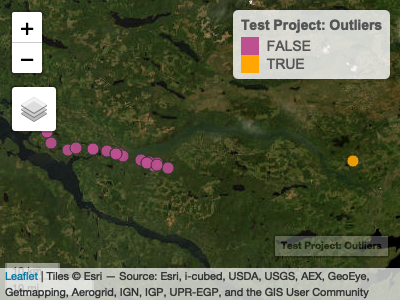

<!-- README.md is generated from README.Rmd. Please edit that file -->

# bccamtrap

<!-- badges: start -->

[](https://github.com/ateucher/bccamtrap/actions/workflows/R-CMD-check.yaml)
[](https://github.com/bcgov/repomountie/blob/master/doc/lifecycle-badges.md)
[](https://app.codecov.io/gh/bcgov/bccamtrap?branch=main)
<!-- badges: end -->

Functions for QA and validation of Camera Trap data

## Installation

You can install the development version of bccamtrap from
[GitHub](https://github.com/) using the
[devtools](https://devtools.r-lib.org/) package (you may need to install
it first):

``` r
# install.packages("devtools")
devtools::install_github("bcgov/bccamtrap")
```

## Example Usage

This package is being developed for camera trap studies in the West
Coast Region, BC Ministry of Water, Land, and Resource Stewardship
(WLRS).

The functions in this package currently assume your project and
session-level data are stored in a BC Government [Wildlife Data
Submission
Template](https://www2.gov.bc.ca/gov/content?id=DC67BCBF8B1E462889B854364364D2D1)
for Camera Trap Data, augmented with additional fields.

The image data is expected to be in multiple csv files, in one folder
per project. The csv files have been generated by reviewing the images
in [TimeLapse](https://saul.cpsc.ucalgary.ca/timelapse/) software, using
the template `v20230518`.

**Note that example data has been obfuscated to protect the location of
the projects.**

To begin, set the paths to the project metadata file, and the folder
containing the TimeLapse image files:

``` r
library(bccamtrap)

metadata_path <- "~/data/project-files/project_1_RISC_WCR_Database_Template_v20230518.xlsm"
data_path <- "~/data/wc-wlrs-cam-data/camera-data/project_1/"
```

### Project and station metadata

Read in project metadata from the SPI worksheet. There are functions to
read the relevant tabs:

#### Project Information

``` r
proj <- read_project_info(metadata_path)
proj
#> # A tibble: 1 × 4
#>   spi_project_id project_name                  survey_name survey_intensity_code
#> * <chr>          <chr>                         <chr>       <chr>                
#> 1 <NA>           2022 - ongoing - Roosevelt E… 2022-2023 … <NA>
```

#### Sample station information

Read the sample station information. This creates a spatial data frame
of class `"sf"`, from the [sf](https://r-spatial.github.io/sf/) package.
This format allows us to work with it as a regular data frame, but also
do spatial things with it.

``` r
sample_stations <- read_sample_station_info(metadata_path)
sample_stations
```

    #> Simple feature collection with 21 features and 29 fields
    #> Geometry type: POINT
    #> Dimension:     XY
    #> Bounding box:  xmin: -125.8534 ymin: 53.6787 xmax: -125.0136 ymax: 53.73782
    #> Geodetic CRS:  WGS 84
    #> # A tibble: 21 × 24
    #>    wlrs_project_name      study_area_name study_area_photos sample_station_label
    #>    <chr>                  <chr>           <chr>             <chr>               
    #>  1 2022 - ongoing - Roos… Test Project    Y                 19_1                
    #>  2 2022 - ongoing - Roos… Test Project    Y                 19_2                
    #>  3 2022 - ongoing - Roos… Test Project    Y                 20                  
    #>  4 2022 - ongoing - Roos… Test Project    Y                 21_1                
    #>  5 2022 - ongoing - Roos… Test Project    Y                 21_2                
    #>  6 2022 - ongoing - Roos… Test Project    Y                 24                  
    #>  7 2022 - ongoing - Roos… Test Project    Y                 25                  
    #>  8 2022 - ongoing - Roos… Test Project    Y                 26                  
    #>  9 2022 - ongoing - Roos… Test Project    Y                 27                  
    #> 10 2022 - ongoing - Roos… Test Project    Y                 28                  
    #> # ℹ 11 more rows
    #> # ℹ 20 more variables: station_status <chr>, number_of_cameras <dbl>,
    #> #   set_date <dttm>, general_location <chr>, elevation_m <dbl>,
    #> #   slope_percent <dbl>, aspect_degrees <dbl>, crown_closure_percent <dbl>,
    #> #   camera_bearing_degrees <dbl>, camera_height_cm <dbl>,
    #> #   distance_to_feature_m <dbl>, visible_range_m <dbl>, habitat_feature <chr>,
    #> #   lock <chr>, code <chr>, sample_station_comments <chr>, …

Use the `qa_stations_spatial()` function to run some basic spatial
validation on the data - namely checking for spatial outliers:

``` r
sample_stations <- qa_stations_spatial(sample_stations)
#> ! Station 19_1 appears to be very far away from other stations. Please check
#> its coordinates.
```

Use the `summary()` method for Sample Station Info for basic descriptive
stats:

``` r
summary(sample_stations)
#> ┌ Test Project ───────┐
#> │                     │
#> │   Sample Stations   │
#> │                     │
#> └─────────────────────┘
#> ℹ 18 sample stations in 21 locations.
#> ℹ Summary of station distances (m):
#>     Min.  1st Qu.   Median     Mean  3rd Qu.     Max. 
#>     5.08  4247.81  8712.00 11935.96 14562.39 55516.29
#> ✖ Detected 1 potential spatial outlier.
#> ℹ Station status summary:
#> Camera Active  Camera Moved 
#>            18             3
#> ℹ Set dates: Between 2022-11-07 and 2023-11-16
#> ! Run `map_stations(object)` to view stations on a map.
```

Use the `map_stations()` function to create an interactive map the of
the stations. This will show any potential outlying stations, indicating
possible data errors:

``` r
map_stations(sample_stations)
```



#### Camera Information:

Read camera information using `read_camera_info()`:

``` r
camera_info <- read_camera_info(metadata_path)
camera_info
```

    #> Simple feature collection with 21 features and 14 fields
    #> Geometry type: POINT
    #> Dimension:     XY
    #> Bounding box:  xmin: -125.5219 ymin: 49.28703 xmax: -125.2213 ymax: 49.34728
    #> Geodetic CRS:  WGS 84
    #> # A tibble: 21 × 9
    #>    wlrs_project_name         study_area_name parent_sample_statio…¹ camera_label
    #>    <chr>                     <chr>           <chr>                  <chr>       
    #>  1 2022 - ongoing - Rooseve… Test Project    19_1                   UBC 2       
    #>  2 2022 - ongoing - Rooseve… Test Project    19_2                   UBC 1       
    #>  3 2022 - ongoing - Rooseve… Test Project    20                     Eco1059     
    #>  4 2022 - ongoing - Rooseve… Test Project    21_1                   Eco1057     
    #>  5 2022 - ongoing - Rooseve… Test Project    21_2                   Eco7998     
    #>  6 2022 - ongoing - Rooseve… Test Project    24                     Eco1050     
    #>  7 2022 - ongoing - Rooseve… Test Project    25                     Eco1040     
    #>  8 2022 - ongoing - Rooseve… Test Project    26                     Eco7939     
    #>  9 2022 - ongoing - Rooseve… Test Project    27                     Eco6690     
    #> 10 2022 - ongoing - Rooseve… Test Project    28                     UBC 4       
    #> # ℹ 11 more rows
    #> # ℹ abbreviated name: ¹​parent_sample_station_label
    #> # ℹ 5 more variables: make_of_camera_code <chr>, model_of_camera <chr>,
    #> #   camera_comments <chr>, site_description_comments <chr>,
    #> #   site_description_date <dttm>

#### Camera Setup and Checks:

``` r
camera_setup_checks <- read_cam_setup_checks(metadata_path)
camera_setup_checks
```

    #> # A tibble: 43 × 31
    #>    wlrs_project_name       study_area_name sample_station_label deployment_label
    #>    <chr>                   <chr>           <chr>                <chr>           
    #>  1 2022 - ongoing - Roose… Test Project    19_1                 <NA>            
    #>  2 2022 - ongoing - Roose… Test Project    19_2                 <NA>            
    #>  3 2022 - ongoing - Roose… Test Project    20                   <NA>            
    #>  4 2022 - ongoing - Roose… Test Project    21_1                 <NA>            
    #>  5 2022 - ongoing - Roose… Test Project    21_2                 <NA>            
    #>  6 2022 - ongoing - Roose… Test Project    24                   <NA>            
    #>  7 2022 - ongoing - Roose… Test Project    25                   <NA>            
    #>  8 2022 - ongoing - Roose… Test Project    26                   <NA>            
    #>  9 2022 - ongoing - Roose… Test Project    27                   <NA>            
    #> 10 2022 - ongoing - Roose… Test Project    28                   <NA>            
    #> # ℹ 33 more rows
    #> # ℹ 27 more variables: camera_label <chr>, surveyors <chr>,
    #> #   date_time_checked <dttm>, sampling_start <dttm>, sampling_end <dttm>,
    #> #   total_visit_or_deployment_time <dbl>, unit_of_total_time_code <chr>,
    #> #   visit_type <chr>, camera_status_on_arrival <chr>, battery_level <chr>,
    #> #   batteries_changed <chr>, number_of_photos <dbl>, quiet_period_s <chr>,
    #> #   trigger_sensitivity <chr>, trigger_timing_s <dbl>, …

#### Deployments

Rather than just looking at the raw camera setup and checks or stations,
there is more utility in assembling sampling deployments by combining
the sample station information and the camera setup and checks. Do this
with the `make_deployments()` function.

``` r
deployments <- make_deployments(metadata_path)
deployments
```

    #> Simple feature collection with 28 features and 62 fields
    #> Geometry type: POINT
    #> Dimension:     XY
    #> Bounding box:  xmin: -130.3966 ymin: 52.92087 xmax: -129.569 ymax: 52.96732
    #> Geodetic CRS:  WGS 84
    #> # A tibble: 28 × 57
    #>    wlrs_project_name       study_area_name sample_station_label deployment_label
    #>    <chr>                   <chr>           <chr>                <chr>           
    #>  1 2022 - ongoing - Roose… Test Project    19_1                 19_1_20230605   
    #>  2 2022 - ongoing - Roose… Test Project    19_2                 19_2_20230605   
    #>  3 2022 - ongoing - Roose… Test Project    20                   20_20230605     
    #>  4 2022 - ongoing - Roose… Test Project    21_1                 21_20230605     
    #>  5 2022 - ongoing - Roose… Test Project    21_2                 21_2_20230605   
    #>  6 2022 - ongoing - Roose… Test Project    24                   24_20230708     
    #>  7 2022 - ongoing - Roose… Test Project    25                   25_20230710     
    #>  8 2022 - ongoing - Roose… Test Project    26                   26_20230710     
    #>  9 2022 - ongoing - Roose… Test Project    27                   27_20230605     
    #> 10 2022 - ongoing - Roose… Test Project    28                   28_20230605     
    #> # ℹ 18 more rows
    #> # ℹ 53 more variables: camera_label <chr>, surveyors <chr>,
    #> #   date_time_checked <dttm>, sampling_end <dttm>,
    #> #   total_visit_or_deployment_time <dbl>, unit_of_total_time_code <chr>,
    #> #   visit_type <chr>, camera_status_on_arrival <chr>, battery_level <chr>,
    #> #   batteries_changed <chr>, number_of_photos <dbl>, quiet_period_s <chr>,
    #> #   trigger_sensitivity <chr>, trigger_timing_s <dbl>, …

There is a handy `summary()` method for this as well:

``` r
summary(deployments)
#> ┌ Test Project ───┐
#> │                 │
#> │   Deployments   │
#> │                 │
#> └─────────────────┘
#> ℹ 15 sample stations in 28 deploymentss.
#> ℹ Deployment lengths range between 113 and 245 days.
#> ℹ Camera status on arrival summary:
#> Active 
#>     28
#> ℹ There are 19201 images. Photos per deployment range betwen 189 and 3554.
```

We can use the [mapview](https://r-spatial.github.io/mapview/) package
to quickly visualize this, setting the `zcol` argument to the name of
the column you’d like to colour the points by. Clicking on a point will
give you the details of that deployment.

``` r
library(mapview)
mapview(deployments, zcol = "sample_station_label")
```


### Project Metadata: Field Form CSV files

There are also two functions for reading in the different csv outputs
from the field forms: Sample Stations, and Deployments:

``` r
sample_station_info <- read_sample_station_csv("path-to-sample-stations.csv")
```

``` r
deployments <- read_deployments_csv("path-to-deployments.csv")
```

### Image data

We can read in an entire directory of image data from multiple csv
files, as long as they all follow the same TimeLapse template. Currently
it is expected that they follow the `v20230518` template.

``` r
image_data <- read_image_data(data_path)
image_data
```

    #> # A tibble: 11,833 × 42
    #>    root_folder study_area_name sample_station_label deployment_label
    #>    <chr>       <chr>           <chr>                <chr>           
    #>  1 100RECNX    Test Project    19_1                 19_1_20230605   
    #>  2 100RECNX    Test Project    19_1                 19_1_20230605   
    #>  3 100RECNX    Test Project    19_1                 19_1_20230605   
    #>  4 100RECNX    Test Project    19_1                 19_1_20230605   
    #>  5 100RECNX    Test Project    19_1                 19_1_20230605   
    #>  6 100RECNX    Test Project    19_1                 19_1_20230605   
    #>  7 100RECNX    Test Project    19_1                 19_1_20230605   
    #>  8 100RECNX    Test Project    19_1                 19_1_20230605   
    #>  9 100RECNX    Test Project    19_1                 19_1_20230605   
    #> 10 100RECNX    Test Project    19_1                 19_1_20230605   
    #> # ℹ 11,823 more rows
    #> # ℹ 38 more variables: date_time <dttm>, episode <chr>, species <chr>,
    #> #   total_count_episode <dbl>, obj_count_image <int>, adult_male <int>,
    #> #   adult_female <int>, adult_unclassified_sex <int>, yearling_male <int>,
    #> #   yearling_female <int>, yearling_unclassified_sex <int>,
    #> #   young_of_year_unclassified_sex <int>, juvenile_unclassified_sex <int>,
    #> #   male_unclassified_age <int>, female_unclassified_age <int>, …

Again, we can use the `summary()` method to get an overview of the image
data.

``` r
summary(image_data)
#> ┌ Test Project ─────┐
#> │                   │
#> │   Image summary   │
#> │                   │
#> └───────────────────┘
#> ℹ 11833 images in 17 deployments at 15 sample stations.
#> ℹ Image counts by trigger mode:
#> Motion Detection       Time Lapse 
#>             8657             3176
#> ℹ 117 images with lens obscured.
#> ℹ 4 images starred.
#> ! 4 images flagged for review.
#> ℹ Dates are between 2022-11-07 and 2023-07-10.
#> ℹ Temperatures are between -10 and 37 C.
#> ℹ Snow depths are between 0 and 135 cm.
#> ℹ Species counts:
#> Avian (comments)       Black Bear           Cougar        Mule Deer 
#>                6              130               12              155 
#> Other (comments)   Pacific Marten     Red Squirrel    Roosevelt Elk 
#>                1                2                1               88 
#>             <NA> 
#>            11438
#> ! Run `qa_deployment_images()` to crosscheck images with deployments.
#> ! Run `qa_image_data()` to run various QA checks.
```

Use the `qa_deployment_images()` function to find deployment labels that
are in the deployment data but not in the image data, and vice-versa. It
is usually likely that there will be deployment labels in the deployment
data that are missing from the image data if not all of the images have
been processed yet. Deployment labels that are present in the image data
but not in the deployment data indicate a potential problem.

``` r
qa_deployment_images(deployments, image_data)
#> ! The following deployment labels are present in `image_data` but not `deployments`: "21_1_20230605", "2022-11-10", and "2023-01-10"
#> ! The following deployment labels are present in `deployments` but not `image_data`: "21_20230605", "19_1_20231107", "19_2_20231107", "20_20231107", "21_20231107", "21_2_20231108", "25_20231031", "26_20231031", "27_20231031", "28_20231031", "29_1_20231031", "29_2_20231031", "29_3_20231107", and "31_20231107"
```

Use `merge_deployments_images()` to join the deployment metadata to the
images:

``` r
images_with_metadata <- merge_deployments_images(deployments, image_data)
#> ! The following deployment labels are present in `image_data` but not `deployments`: "21_1_20230605", "2022-11-10", and "2023-01-10"
#> ! The following deployment labels are present in `deployments` but not `image_data`: "21_20230605", "19_1_20231107", "19_2_20231107", "20_20231107", "21_20231107", "21_2_20231108", "25_20231031", "26_20231031", "27_20231031", "28_20231031", "29_1_20231031", "29_2_20231031", "29_3_20231107", and "31_20231107"
images_with_metadata
#> Simple feature collection with 11833 features and 101 fields (with 1208 geometries empty)
#> Geometry type: POINT
#> Dimension:     XY
#> Bounding box:  xmin: -130.3966 ymin: 52.92237 xmax: -129.569 ymax: 52.96732
#> Geodetic CRS:  WGS 84
#> # A tibble: 11,833 × 96
#>    root_folder deployment_label date_time           episode species
#>    <chr>       <chr>            <dttm>              <chr>   <chr>  
#>  1 100RECNX    19_1_20230605    2022-11-10 15:15:53 1:1|5   <NA>   
#>  2 100RECNX    19_1_20230605    2022-11-10 15:15:58 1:2|5   <NA>   
#>  3 100RECNX    19_1_20230605    2022-11-10 15:16:25 1:3|5   <NA>   
#>  4 100RECNX    19_1_20230605    2022-11-10 15:16:27 1:4|5   <NA>   
#>  5 100RECNX    19_1_20230605    2022-11-10 15:16:31 1:5|5   <NA>   
#>  6 100RECNX    19_1_20230605    2022-11-11 12:00:00 2:1|1   <NA>   
#>  7 100RECNX    19_1_20230605    2022-11-12 12:00:00 3:1|1   <NA>   
#>  8 100RECNX    19_1_20230605    2022-11-13 12:00:00 4:1|1   <NA>   
#>  9 100RECNX    19_1_20230605    2022-11-14 12:00:00 5:1|1   <NA>   
#> 10 100RECNX    19_1_20230605    2022-11-15 12:00:00 6:1|1   <NA>   
#> # ℹ 11,823 more rows
#> # ℹ 91 more variables: total_count_episode <dbl>, obj_count_image <int>,
#> #   adult_male <int>, adult_female <int>, adult_unclassified_sex <int>,
#> #   yearling_male <int>, yearling_female <int>,
#> #   yearling_unclassified_sex <int>, young_of_year_unclassified_sex <int>,
#> #   juvenile_unclassified_sex <int>, male_unclassified_age <int>,
#> #   female_unclassified_age <int>, unclassified_life_stage_and_sex <int>, …
```

#### Image Data QA

There are a number of common data quality issues that we can check for
in the image data itself, aside from those addressed above when
reconciling deployments and images.

We can use the `qa_image_data()` function to detect the following
problems:

- Check for blanks in key fields: study area, station label, deployment
  date, surveyor, trigger mode, temperature, episode
- Species detected with no count data
- Count data with no species
- Sum of individual count fields equals Total Count
- Multiple entries under same Episode number (indicating possible double
  entry)
- Ensure dates for timelapse images are continuous and in order.
- Snow data
  - No blanks unless lens obscured is `TRUE`
  - Look for snow depth outliers (e.g., 10, 10, 110, 10, 15, 20)

Run the `qa_image_data()` function:

``` r
image_data_qa <- qa_image_data(image_data)
dim(image_data_qa)
#> [1] 24 53
```

We can see that this has identified 24 records with potential problems.
This dataset has a number of fields starting with `QA_` which help us
know which images we should have a closer look at. All of the original
fields, plus any `QA_` fields that have at least one `TRUE` value are
returned:

``` r
names(image_data_qa)
#>  [1] "root_folder"                     "study_area_name"                
#>  [3] "sample_station_label"            "deployment_label"               
#>  [5] "date_time"                       "episode_num"                    
#>  [7] "episode"                         "species"                        
#>  [9] "total_count_episode"             "obj_count_image"                
#> [11] "adult_male"                      "adult_female"                   
#> [13] "adult_unclassified_sex"          "yearling_male"                  
#> [15] "yearling_female"                 "yearling_unclassified_sex"      
#> [17] "young_of_year_unclassified_sex"  "juvenile_unclassified_sex"      
#> [19] "male_unclassified_age"           "female_unclassified_age"        
#> [21] "unclassified_life_stage_and_sex" "antler_class"                   
#> [23] "animal_identifiable"             "animal_tagged"                  
#> [25] "behaviour_1"                     "behaviour_2"                    
#> [27] "behaviour_3"                     "human_use_type"                 
#> [29] "human_transport_mode"            "temperature"                    
#> [31] "snow_depth"                      "snow_is_est"                    
#> [33] "snow_depth_lower"                "snow_depth_upper"               
#> [35] "lens_obscured"                   "starred"                        
#> [37] "needs_review"                    "comment"                        
#> [39] "surveyor"                        "trigger_mode"                   
#> [41] "file"                            "relative_path"                  
#> [43] "delete_flag"                     "QA_BLANK_study_area_name"       
#> [45] "QA_BLANK_sample_station_label"   "QA_BLANK_deployment_label"      
#> [47] "QA_BLANK_date_time"              "QA_BLANK_surveyor"              
#> [49] "QA_BLANK_trigger_mode"           "QA_BLANK_temperature"           
#> [51] "QA_BLANK_episode"                "QA_timelapse_lag"               
#> [53] "QA_snow_outlier"
```

``` r
select(image_data_qa, root_folder, file, starts_with("QA_"))
#> # A tibble: 24 × 12
#>    root_folder   file         QA_BLANK_study_area_name QA_BLANK_sample_station…¹
#>    <chr>         <chr>        <lgl>                    <lgl>                    
#>  1 27_20230605   RCNX0030.JPG FALSE                    FALSE                    
#>  2 100RECNX      RCNX0114.JPG FALSE                    FALSE                    
#>  3 100RECNX      RCNX0118.JPG FALSE                    FALSE                    
#>  4 21_2_20230605 RCNX0010.JPG FALSE                    FALSE                    
#>  5 100RECNX      RCNX0261.JPG FALSE                    FALSE                    
#>  6 100RECNX      RCNX0339.JPG FALSE                    FALSE                    
#>  7 100RECNX      RCNX0376.JPG FALSE                    FALSE                    
#>  8 29_2_20230605 IMG_0252.JPG FALSE                    FALSE                    
#>  9 100RECNX      IMG_0134.JPG FALSE                    FALSE                    
#> 10 102RECNX      RCNX0041.JPG FALSE                    FALSE                    
#> # ℹ 14 more rows
#> # ℹ abbreviated name: ¹​QA_BLANK_sample_station_label
#> # ℹ 8 more variables: QA_BLANK_deployment_label <lgl>,
#> #   QA_BLANK_date_time <lgl>, QA_BLANK_surveyor <lgl>,
#> #   QA_BLANK_trigger_mode <lgl>, QA_BLANK_temperature <lgl>,
#> #   QA_BLANK_episode <lgl>, QA_timelapse_lag <lgl>, QA_snow_outlier <lgl>
```

### Plots

There are several plotting functions available to help you visualize
your data and spot any potential problems. By default, all plots render
as static images, but can be created as interactive plots by setting
`interactive = TRUE`. Interactive plots are not shown here as they don’t
render in the `README`.

#### Deployment plot

We can plot deployments to see that the start and ends of our
deployments are as expected, and flag any “invalid” deployments (i.e.,
where we don’t know the end time because a camera was stolen, bumped,
ran out of batteries etc.). You can make static or interactive plots:

``` r
plot_deployments(deployments, date_breaks = "2 months")
```


``` r
# plot_deployments(deployments, interactive = TRUE, date_breaks = "2 months")
```

#### Snow depth plot

We can plot the recorded snow depths across deployments using the
`plot_snow()` function with our image data:

``` r
plot_snow(image_data, date_breaks = "2 months")
```


``` r
# plot_snow(image_data, date_breaks = "2 months", interactive = TRUE)
```

#### Detection plot

We can also plot image timestamps over the deployment durations to alert
us to potential time mismatches between the session data and image time
labels. Mismatches could indicate wrong time settings on cameras, errors
in deployment labels (as the below indicates), or any number of data
entry errors.

``` r
plot_deployment_detections(deployments, image_data, date_breaks = "2 months")
```


``` r
# plot_deployment_detections(deployments, image_data, interactive = TRUE, date_breaks = "2 months")
```

#### Daily detection patterns

We can plot the patterns of daily detections by species:

``` r
plot_diel_activity(image_data)
```


``` r
# plot_diel_activity(image_data, interactive = TRUE)
```

### Write Data to SPI template

bccamtrap also has functionality to write out data to a SPI template for
submission.

Use `fill_spi_template()` to write all of the data to a SPI template,
filling in just the default required fields. This will fill in all of
the tabs except for the Project Info sheet which you must fill in
manually.

``` r
fill_spi_template(
  sample_stations,
  camera_info, 
  camera_setup_checks,
  image_data,
  file = "~/Desktop/SPI_output.xlsx"
)
```

If you want more control, such as adding data to other fields in the SPI
template, use `write_to_spi_sheet()`.

If you want to write to an existing file, specify the same file name in
both the `file` and the `template` parameters. To write columns other
than the default columns, specify paired column names in the form
`` `Destination Column` = data_column ``. If the left-hand side is a
syntactically valid name it can be provided as-is, but if it has spaces
in it it must be wrapped in backticks or quotes.

``` r
write_to_spi_sheet(
  sample_stations,
  file = "~/Desktop/SPI_output.xlsx",
  `Number of Cameras` = number_of_cameras,
  template = "~/Desktop/SPI_output.xlsx"
)
```

#### Writing to SPI template using field form data

To write data imported from field form data, you must use the
`fill_spi_template_ff()` function, passing in both the
`sample_station_info` and `deployments`, as well as the `image_data`.

If you want to only write to the metadata tabs and not the Sequence
Image Data, you can leave the `image_data` argument as `NULL`, and write
to the file another time with `write_to_spi_sheet()`.

``` r
sample_station_info <- read_sample_station_csv("path-to-sample-stations.csv")
deployments <- read_deployments_csv("path-to-deployments.csv")

fill_spi_template_ff(
  sample_stations,
  deployments,
  image_data,
  file = "~/Desktop/SPI_output_from_ff.xlsx"
)
```

### Project Status

### Getting Help or Reporting an Issue

To report bugs/issues/feature requests, please file an
[issue](https://github.com/bcgov/bccamtrap/issues/).

### How to Contribute

If you would like to contribute, please see our
[CONTRIBUTING](CONTRIBUTING.md) guidelines.

Please note that this project is released with a [Contributor Code of
Conduct](CODE_OF_CONDUCT.md). By participating in this project you agree
to abide by its terms.

### License

    Copyright 2024 Province of British Columbia

    Licensed under the Apache License, Version 2.0 (the &quot;License&quot;);
    you may not use this file except in compliance with the License.
    You may obtain a copy of the License at

    http://www.apache.org/licenses/LICENSE-2.0

    Unless required by applicable law or agreed to in writing, software distributed under the License is distributed on an &quot;AS IS&quot; BASIS,
    WITHOUT WARRANTIES OR CONDITIONS OF ANY KIND, either express or implied.
    See the License for the specific language governing permissions and limitations under the License.
